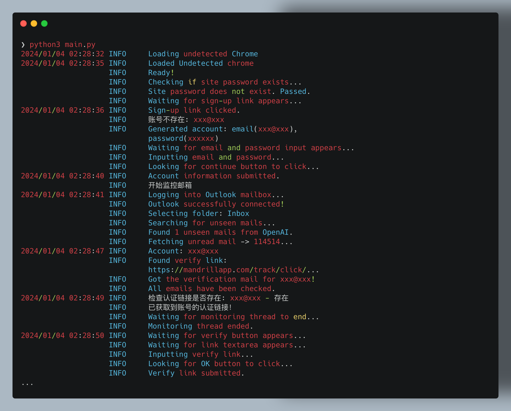
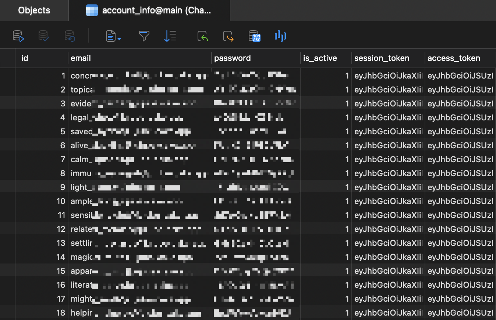
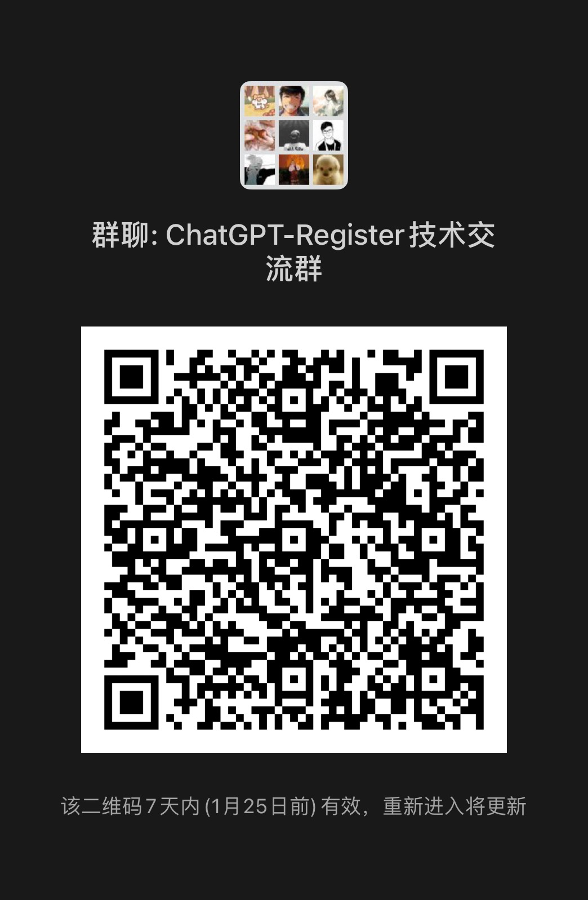

# ChatGPT-Register

<div align="center">
   
   🫷🥹🫸
   
</div>

<br/>

**ChatGPT-Register** 是一个自动化工具，**免代理**、**不封号**、~~**无限量**~~（受限于`PandoraNext`额度）、**无人工干预**地注册 ChatGPT 账号。

同时可获取、刷新、维护各类**Token**（包括`sess key`）。一键刷新将过期的Token们！

结合[PandoraNext](https://docs.pandoranext.com/zh-CN)项目和[Capsolver](https://dashboard.capsolver.com/passport/register?inviteCode=XnJJ1V9nqA0U)，它实现了一个高效的注册流程。

完全模拟整个注册流程，在安全无风险的基础上，单个实例注册用时仅需 2min！且多开情况下，每个实例互不影响。


## 特点

- 🚀 **自动化注册**：自动完成整个ChatGPT账号注册流程，使用`Capsolver`来绕过注册中的验证码，无需判断验证码类型。
- 🌐 **免代理**：不用代理池、注册再多也不被ban本机IP。（感谢`PandoraNext`项目的贡献）
- 📧 **邮箱监控**：自动监控和处理OpenAI的`Verification`认证邮件。
- 🐍 **Python脚本**：使用`Python`和`selenium`自动操作，并使用`undetected_chromedriver`防止检测。
- 🐳 **Docker支持**：通过`Docker Compose`轻松部署。
- 📦 **灵活数据存储**：结果保存在`SQLite`数据库，支持自定义存储。

## 安装指南

### 公共步骤：
1. 克隆仓库：
   ```bash
   git clone https://github.com/QvQQ/ChatGPT-Register
   cd ChatGPT-Register
   ```
2. 复制并编辑配置文件：
   ```bash
   cp config_template.yaml config.yaml
   # 编辑 config.yaml 文件
   ```
3. **根据你的平台类型安装Chrome**（注意，不是Chromium）

### 方法一：通过本机直接运行（推荐）
1. 安装依赖：
   ```bash
   pip install -r requirements.txt
   ```
2. 运行脚本：
   ```bash
   python main.py
   ```

### 方法二：使用Docker Compose
1. 在项目根目录下运行：
   ```bash
   touch account.db  # 创建数据库文件，防止映射失败
   docker compose up
   ```
    PS. 由于使用了 Selenium 来模拟请求，对主机配置有较高要求。如果报错，可以尝试延长程序中寻找元素的等待时间。
    PPS. 由于docker会将不存在的文件默认映射为文件夹，因此需要在项目中先`touch accound.db`才可正常映射。

2. （可选）要查看容器内部的情况，请访问容器内置的 `noVNC` 服务
   http://localhost:7900/?autoconnect=1&resize=scale&password=secret

## 结果存储

注册的结果将被保存在SQLite数据库 `account.db` 中。您可以使用Navicat等软件查看数据库，或修改存储函数将结果存储至txt文件中。欢迎提出Pull Request共同改进项目。
- **Update 2024.1.5** 现在可以连接远程服务器的数据库了！

## 配置文件说明

`config_template.yaml` 文件中包含以下配置项：

```yaml

# 是否使用 headless 模式(Docker 中应该开启，本地可以关闭测试)
headless_browser: true

# 注册账号的邮箱后缀，包含`@`
account_postfix: ""

# Capsolver 的 client_key
client_key: ""

# PandoraNext 的镜像站网址
# 若没有可以使用 https://chat.oaifree.com（该网站已加CF验证，请部署自己的镜像站！）
pandora_next_website: ""

# PandoraNext 镜像站的 site_password，如果没有可留空
site_password: ""

# 接收 OpenAI 认证邮件的邮箱 IMAP 服务器设置(须支持SSL)
IMAP_server: "outlook.office365.com"
IMAP_port: 993

# 接收 OpenAI 认证邮件的邮箱的账号与密码
email_username: ""
email_password: ""

# 接收 OpenAI 认证邮件的邮箱的收件箱名称，一般是 Inbox (对于 Outlook 而言)
email_folder: "Inbox"

# ChatGPT 使用的 FunCaptcha 的类型
# 不定期会改变，可以到 Capsovler 网站查看对应类型
# puzzle_type: "train_coordinates"  # 由于使用了 CapSolver 的浏览器插件自动判断类型，本项已不再需要


# For refresher_tokens_cli.py

# ninja 的 baseURL，e.g. http://localhost:7999
ninja_base_url: ""

# PandoraNext 镜像站的 baseURL
# 包括proxy_api_prefix，e.g. https://foo.bar/this_is_proxy_api_prefix/
pandora_next_base_url: ""

# 要更新的 pool_token，留空则为新生成一个 pool_token
pandora_next_pool_token: ""
```
* **client_key**: 需要使用Capsolver的服务来解决验证码。新注册用户可以获得1刀额度[[点击注册]](https://dashboard.capsolver.com/passport/register?inviteCode=XnJJ1V9nqA0U)（平均每个账号花费1分多RMB）
* ~~**puzzle_type**: 如果在尝试解决验证码时出错，可以用`./solved`中的验证码图片与[Capsolver Documentation](https://docs.capsolver.com/guide/recognition/FunCaptchaClassification.html)中提供的验证码类型进行对比，并填写相应的`Questions`字段即可。~~
 
  (由于使用了 CapSolver 的浏览器插件自动判断类型，本项已不再需要)

请根据您的需要编辑这些配置项。

## 使用`refresh_tokens_cli` 获取各种 Token、sess key


* 本工具同时支持`Ninja`与`PandoraNext`两种模式。默认为`PandoraNext`，通过添加`--ninja`参数切换为`Ninja`模式。
* 本工具用来`获取(obtain)`/`刷新(refresh)`当前数据库中账号的
  * **Web**: `session_token`、`access_toekn`、`share_token`
  * **Platform**: `refresh_token`、`access_token`、`sess key`
* 使用示例：
  * 通过`PandoraNext`获取1000个账号的`session_token`、`access_toekn`、`share_token`
    ```python
    python3 refresh_tokens_cli.py obtain --count=1000 --type=web
    ```
  * 通过`Ninja`获取所有账号的`refresh_token`、`access_token`、`sess key`
    ```python
    python3 refresh_tokens_cli.py obtain --ninja --count=-1 --type=platform
    ```
  * 通过`PandoraNext`刷新还剩下5天就过期的所有`session_token`、`access_toekn`、`share_token`
    ```python
    python3 refresh_tokens_cli.py refresh --count=-1 --remaining=5 --type=web
    ```
  * 以此类推。
* 使用前请自行配置好`PandoraNext`或`Ninja`环境，并填写进`config.yaml`中。

<details>
  <summary>点击这里展开详细使用方法</summary>

**Usage**:

```console
$ refresh_tokens_cli [OPTIONS] COMMAND [ARGS]...
```

**Options**:

* `--help`: Show this message and exit.

**Commands**:

* `assemble`: Assemble pool token
* `obtain`: Obtain new session tokens if not exists.
* `refresh`: Refresh tokens.

## `refresh_tokens_cli assemble`

Assemble pool token

**Usage**:

```console
$ refresh_tokens_cli assemble [OPTIONS]
```

**Options**:

* `--count INTEGER`: Number of accounts to process  [default: 100]
* `--help`: Show this message and exit.

## `refresh_tokens_cli obtain`

Obtain new session tokens if not exists.

**Usage**:

```console
$ refresh_tokens_cli obtain [OPTIONS]
```

**Options**:

* `--ninja / --no-ninja`: Use ninja as backend. Default to PandoraNext.  [default: no-ninja]
* `--type TEXT`: Obtain tokens of web or platform.  [default: web]
* `--count INTEGER`: Number of accounts to process.  [default: 10]
* `--help`: Show this message and exit.

## `refresh_tokens_cli refresh`

Refresh tokens.

**Usage**:

```console
$ refresh_tokens_cli refresh [OPTIONS]
```

**Options**:

* `--ninja / --no-ninja`: Use ninja as backend. Default to PandoraNext.  [default: no-ninja]
* `--type TEXT`: Obtain tokens of web or platform.  [default: web]
* `--empty-only / --no-empty-only`: Refresh account only if its [web](share token) or [platform](sess key) is empty.  [default: no-empty-only]
* `--count INTEGER`: Number of accounts to process.  [default: -1]
* `--remaining INTEGER`: Number of days remaining until expiration.  [default: 5]
* `--help`: Show this message and exit.
</details>

## ChatGPT-Register 使用示例

- 注册过程的日志截图：
  
  

- 数据库中的账号截图：
  
  

## 加入我们

欢迎加入微信群，获取更多信息和支持：



## 贡献

期待您的Pull Request和建议，一起完善这个项目。

## 许可

本项目采用 MIT 许可证。

> [!CAUTION]  
> This branch is only for personal development, study and research. Please do not use any attachments directly. The author is not responsible for any problems with the source attachments.
# 免责声明

> [!CAUTION]  
> 本分支仅用于个人开发提供学习研究，请勿直接使用任何附件。如出现任何有关源附件问题，本作者概不负责。

---

> [!CAUTION]  
> This branch is only for personal development, study and research. Please do not use any attachments directly. The author is not responsible for any problems with the source attachments.
